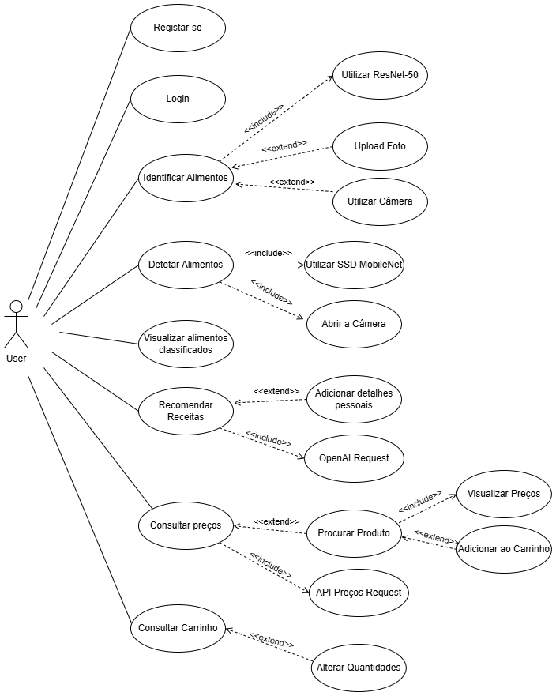

# Recipe-Rescue
This application is able to classify 🎯 and detect 🔎 food in real time using 2 CNNs.

The classification model (ResNet-50) can identify 30 foods 🍔. This model was trained on a dataset built through web scraping 🛠️ using the Kaggle platform.
The real-time food detection model (MobileNetV2) was trained for just 2 classes (Apple 🍎 and Egg 🥚) using the Google Colab platform.

The OpenAI API 🤖 was used to recommend recipes using the LLM GPT-3.5 Turbo Instruct.

Given that supermarkets don't make API's publicly available, it was necessary to do reverse engineering ↩️ to communicate with a private API. In this case, the Prices Crawler website was used, which is able to obtain supermarket prices using Web Scraping techniques.

---
## Ferramentas Utilizadas:
- Android Studio 📱
- Java ♨️
- Firebase 🔥
- API's 🌐 
- Figma 🎨
- Postman 🚀
- TensorFlow 🕸
- Convolutional Neural Networks (CNN) 🌀
- Kaggle 🎯
- Google Colab 🔎
- Web Scraping 🛠️ with Python, Selenium and ChromeDriver to extract images from Google, Bing and Yahoo

## Use Cases

